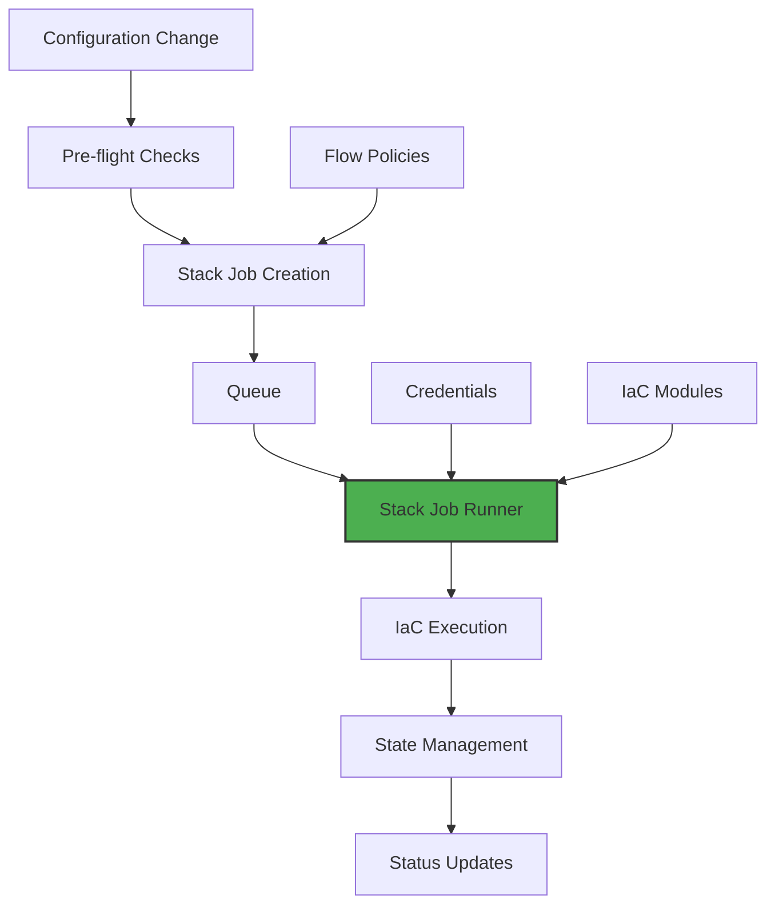

# Stack Jobs Deep Dive

## Master the Infrastructure Automation Engine

You've deployed your first resources and watched Stack Jobs in action. Now let's dive deep into how they work, how to optimize them, and how to handle complex scenarios. This guide is for when you need to go beyond the basics.

> **Stack Job Philosophy**: Infrastructure changes should be predictable, auditable, and reversible. Every Stack Job embodies these principles through careful orchestration and state management.

## The Complete Stack Job Architecture

Stack Jobs aren't just script runners—they're a sophisticated orchestration system:



Let's explore each component in detail.

## Pre-flight Checks: Failing Fast

Before a Stack Job is created, the system runs comprehensive pre-flight checks:

### 1. Credential Validation
```yaml
# System checks:
- Is there a credential mapped for this provider/environment?
- Does the credential have necessary permissions?
- Is the credential still valid (not expired)?
- Can we authenticate with the provider?
```

### 2. Module Resolution
```yaml
# Module selection logic:
if organization has custom module for resource:
  use custom module
elif organization has provisioner preference:
  use platform module for that provisioner
else:
  use platform default module
```

### 3. State Backend Verification
```yaml
# Backend checks:
- Is state backend configured for organization?
- Can we access the backend?
- Is there an existing state file?
- Is the state locked by another operation?
```

### 4. Flow Control Policy
```yaml
# Policy resolution hierarchy:
1. Check resource-specific policy
2. Check environment policy  
3. Check organization policy
4. Use platform default policy
```

If any pre-flight check fails, the Stack Job isn't created and you get immediate feedback.

## Stack Job Lifecycle in Detail

### Creation Phase

When creating a Stack Job, the system captures a complete snapshot:

```yaml
apiVersion: infra-hub.planton.cloud/v1
kind: StackJob
metadata:
  id: sj_01jsrnmwpnnc6n62h06xafcgxv
  name: eks_01jq5xe4z7farkgenqsh47c1h0
  org: acmecorp
  env: production
  version:
    id: ver-01jsrnmrwjn57drj0ekht8hb93
    message: "Scale EKS node group from 3 to 5 nodes"
spec:
  # Resource being changed
  apiResourceInfo:
    kind: aws_eks_cluster
    id: eks_01jq5xe4z7farkgenqsh47c1h0
    name: prod-api-cluster
    versionId: ver-01jsrnmrwjn57drj0ekht8hb93
    triggerEvent: updated
    eventCreatedBy: user@company.com
    
  # Everything needed to execute
  essentials:
    # IaC Configuration
    provisioner: terraform
    iacModule:
      id: iacmod_platform_eks_terraform
      gitRepo: github.com/project-planton/aws-eks
      branch: v2.3.0
      path: terraform
      
    # Authentication
    backendCredential:
      kind: terraform_backend_credential
      id: tfcred_s3_backend_prod
      config:
        bucket: acmecorp-terraform-state
        region: us-east-1
        
    providerCredential:
      kind: aws_credential
      id: awscred_prod_account
      
    # Execution
    stackJobRunner:
      id: sjr_platform_runner
      endpoint: runner.planton.cloud:443
      
    # Behavior
    flowControlPolicy:
      previewBeforeUpdate: true
      pauseBetweenPreviewAndUpdate: true
      skipRefresh: false
      
  # Computed operations
  operations:
    - init
    - refresh
    - plan
    - apply
```

### Execution Phase

The Stack Job Runner receives the job and begins execution:

#### Step 1: Workspace Preparation
```bash
# Creates isolated workspace
/tmp/stack-jobs/sj_01jsrnmwpnnc6n62h06xafcgxv/
├── module/          # Cloned IaC module
├── config/          # Generated tfvars/pulumi config
├── state/           # Local state cache
└── logs/            # Execution logs
```

#### Step 2: Module Download
```go
// Actual code from Stack Job Runner
func (r *Runner) cloneModule(job *StackJob) error {
    return git.Clone(git.CloneOptions{
        URL:      job.Spec.Essentials.IacModule.GitRepo,
        Branch:   job.Spec.Essentials.IacModule.Branch,
        Depth:    1,  // Shallow clone for speed
        Auth:     r.githubAuth,
        Progress: job.LogWriter,
    })
}
```

#### Step 3: Configuration Injection
The system transforms your resource spec into IaC variables:

```hcl
# Generated terraform.tfvars
metadata = {
  id   = "eks_01jq5xe4z7farkgenqsh47c1h0"
  name = "prod-api-cluster"
  org  = "acmecorp"
  env  = "production"
}

spec = {
  kubernetes_version = "1.28"
  node_groups = [{
    name           = "general"
    instance_types = ["t3.large"]
    min_size       = 5  # Changed from 3
    max_size       = 10
    desired_size   = 5  # Changed from 3
  }]
}

aws_credential = {
  access_key_id     = "INJECTED_AT_RUNTIME"
  secret_access_key = "INJECTED_AT_RUNTIME"
  region           = "us-east-1"
}
```

#### Step 4: Operation Execution

Each operation runs in sequence with careful error handling:

```go
// Simplified execution flow
for _, op := range job.Spec.Operations {
    switch op {
    case "init":
        err = terraform.Init(
            terraform.BackendConfig(backendCreds),
            terraform.PluginDir(sharedCache),
        )
    case "refresh":
        err = terraform.Refresh(
            terraform.Parallelism(10),
            terraform.Lock(true),
        )
    case "plan":
        plan, err = terraform.Plan(
            terraform.Out("tfplan"),
            terraform.DetailedExitCode(),
        )
        if plan.HasChanges() {
            job.RequireApproval()
        }
    case "apply":
        err = terraform.Apply(
            terraform.Plan("tfplan"),
            terraform.AutoApprove(),
            terraform.Lock(true),
        )
    }
    
    if err != nil {
        job.Fail(op, err)
        return
    }
}
```

### Completion Phase

After execution, the system:
1. Extracts outputs from Terraform/Pulumi
2. Updates resource status with outputs
3. Uploads logs to permanent storage
4. Cleans up temporary workspace
5. Notifies dependent systems

## Advanced Stack Job Features

### Parallel Execution

When deploying multiple resources, Stack Jobs can run in parallel:

```yaml
# Deploy complete environment
resources:
  - kind: aws_vpc
    name: network
  - kind: aws_eks_cluster
    name: cluster
    dependsOn: [network]
  - kind: aws_rds
    name: database
    dependsOn: [network]
  - kind: aws_s3_bucket
    name: storage
    # No dependencies, runs in parallel
```

Execution plan:
```
Phase 1: vpc, s3_bucket (parallel)
Phase 2: eks_cluster, rds (parallel, after vpc)
```

### State Import

Import existing resources into Planton Cloud management:

```bash
# Import existing RDS instance
planton infra import aws-rds prod-db \
  --resource-id db-instance-identifier \
  --provider-resource "aws_db_instance.main"

# Creates special import Stack Job
Stack Job: sj_import_01234567
Operations:
  - init
  - import (instead of plan/apply)
  - refresh
  - plan (to verify import)
```

### Drift Detection

Scheduled Stack Jobs detect and fix drift:

```yaml
apiVersion: infra-hub.planton.cloud/v1
kind: DriftDetectionPolicy
metadata:
  name: nightly-drift-check
spec:
  schedule: "0 2 * * *"  # 2 AM daily
  selector:
    env: production
  operations:
    - refresh
    - plan
  autoRemediate: false  # Just detect, don't fix
```

### Resource Migration

Move resources between state files or providers:

```yaml
# Migration Stack Job
kind: StackJob
spec:
  operation: migrate
  source:
    module: old-vpc-module
    state: s3://old-bucket/terraform.tfstate
  target:
    module: new-vpc-module  
    state: s3://new-bucket/terraform.tfstate
  resourceMappings:
    - source: aws_vpc.main
      target: module.vpc.aws_vpc.this
```

## Performance Optimization

### Module Caching

Stack Job Runners cache IaC modules and providers:

```yaml
# Runner configuration
cache:
  modules:
    ttl: 24h
    maxSize: 10GB
  providers:
    ttl: 7d
    maxSize: 50GB
    shared: true  # Share across jobs
```

Impact: Reduces init time from minutes to seconds.

### State Optimization

For large states, optimize performance:

```yaml
# Split large configurations
Instead of:
- 1 module managing 100 resources

Use:
- 10 modules managing 10 resources each
- Parallel execution
- Smaller blast radius
```

### Provider Parallelism

Configure parallelism for faster operations:

```hcl
# In your custom module
terraform {
  required_providers {
    aws = {
      source  = "hashicorp/aws"
      version = "~> 5.0"
    }
  }
  
  # Increase parallelism
  parallelism = 20  # Default is 10
}
```

## Debugging Stack Jobs

### Verbose Logging

Enable debug mode for detailed logs:

```yaml
# In your Stack Job request
debug:
  enabled: true
  level: trace
  includeProviderLogs: true
```

### Local Reproduction

Reproduce Stack Job locally for debugging:

```bash
# Download Stack Job bundle
planton stack-job download sj_01234567

# Extract and examine
tar -xzf sj_01234567.tar.gz
cd sj_01234567/

# Review generated configuration
cat terraform.tfvars

# Try execution locally
terraform init
terraform plan
```

### Common Issues and Solutions

#### "State lock acquisition failed"

Another operation is running:
```bash
# Check who has the lock
planton stack-job list --state=running --resource=my-resource

# If stuck, force unlock (carefully!)
planton stack-job unlock my-resource --force
```

#### "Provider credential expired"

Token-based credentials may expire during long operations:
```yaml
# Use long-lived credentials for large deployments
# Or configure credential refresh
providerCredential:
  type: aws_assume_role
  roleArn: arn:aws:iam::123456789:role/terraform
  sessionDuration: 3600  # 1 hour
```

#### "Module source not found"

Check module registry configuration:
```bash
# Verify module exists
planton iac-module describe aws-eks-terraform

# For custom modules, check git access
git ls-remote https://github.com/your-org/module
```

## Stack Job Patterns

### The Blue-Green Deployment

Deploy new infrastructure alongside old:

```yaml
# Step 1: Create new environment
apiVersion: infra-hub.planton.cloud/v1
kind: AwsEksCluster
metadata:
  name: prod-api-cluster-v2  # New cluster
spec:
  version: "1.29"  # Newer version
  # ... rest of config

# Step 2: Validate new environment
# Step 3: Switch traffic
# Step 4: Destroy old environment
```

### The Canary Infrastructure

Test changes on subset first:

```yaml
# Canary flow control policy
flowControl:
  canary:
    enabled: true
    percentage: 10
    validationPeriod: 1h
    autoPromote: false
```

### The Disaster Recovery

Automated recovery workflows:

```yaml
# DR Stack Job template
apiVersion: infra-hub.planton.cloud/v1
kind: StackJobTemplate
metadata:
  name: disaster-recovery
spec:
  triggers:
    - healthCheckFailed
    - manualTrigger
  operations:
    - name: validate-backups
      type: custom
      script: |
        aws s3 ls s3://backup-bucket/latest/
    - name: restore-primary
      type: apply
      module: dr-restore-module
    - name: verify-restoration  
      type: custom
      script: |
        curl -f https://api.example.com/health
```

## Monitoring and Observability

### Metrics

Stack Jobs emit metrics for monitoring:

```yaml
# Prometheus metrics
stack_job_duration_seconds{status="succeeded", resource_kind="aws_eks_cluster"} 342
stack_job_operations_total{operation="apply", result="success"} 1523
stack_job_state_size_bytes{resource="prod-cluster"} 1048576
```

### Alerts

Configure alerts for Stack Job issues:

```yaml
# Alert on failed jobs
alert: StackJobFailureRate
expr: rate(stack_job_operations_total{result="failed"}[5m]) > 0.1
for: 10m
annotations:
  summary: "High Stack Job failure rate"
  
# Alert on long-running jobs  
alert: StackJobStuck
expr: stack_job_duration_seconds > 3600
annotations:
  summary: "Stack Job running over 1 hour"
```

### Audit Trail

Every Stack Job maintains complete audit trail:

```json
{
  "stackJobId": "sj_01234567",
  "timestamp": "2024-01-15T10:30:00Z",
  "user": "engineer@company.com",
  "action": "apply",
  "resource": {
    "kind": "aws_eks_cluster",
    "id": "prod-cluster",
    "changes": {
      "nodeGroups[0].desiredSize": {
        "old": 3,
        "new": 5
      }
    }
  },
  "result": "succeeded",
  "duration": "5m42s"
}
```

## Best Practices

### 1. Resource Tagging

Always tag resources for tracking:

```yaml
spec:
  tags:
    managed-by: planton-cloud
    stack-job: ${stack_job.id}
    environment: ${environment}
    owner: ${team}
    cost-center: engineering
```

### 2. State Isolation

Separate states by environment and component:
```
terraform-state/
├── production/
│   ├── network/
│   ├── compute/
│   └── data/
├── staging/
└── development/
```

### 3. Rollback Strategy

Plan for rollbacks before applying:
```yaml
# Before risky changes
1. Create state backup
2. Document rollback procedure  
3. Test in lower environment
4. Have recovery Stack Job ready
```

### 4. Cost Management

Monitor infrastructure costs:
```yaml
# Add cost estimation to flow control
flowControl:
  costEstimation:
    enabled: true
    threshold: 1000  # Require approval if > $1000/month
```

## What's Next?

Now that you understand Stack Jobs deeply:

- **[Flow Control](/docs/infra-hub/flow-control)** - Customize execution policies
- **[Deployment Components](/docs/infra-hub/deployment-components)** - Explore available resources
- **[Custom Modules](/docs/infra-hub/custom-modules)** - Build your own IaC modules
- **[Troubleshooting](/docs/infra-hub/troubleshooting)** - Solve common problems

> **Remember**: Stack Jobs are powerful but designed to be safe. The system prevents dangerous operations by default, so experiment confidently!
